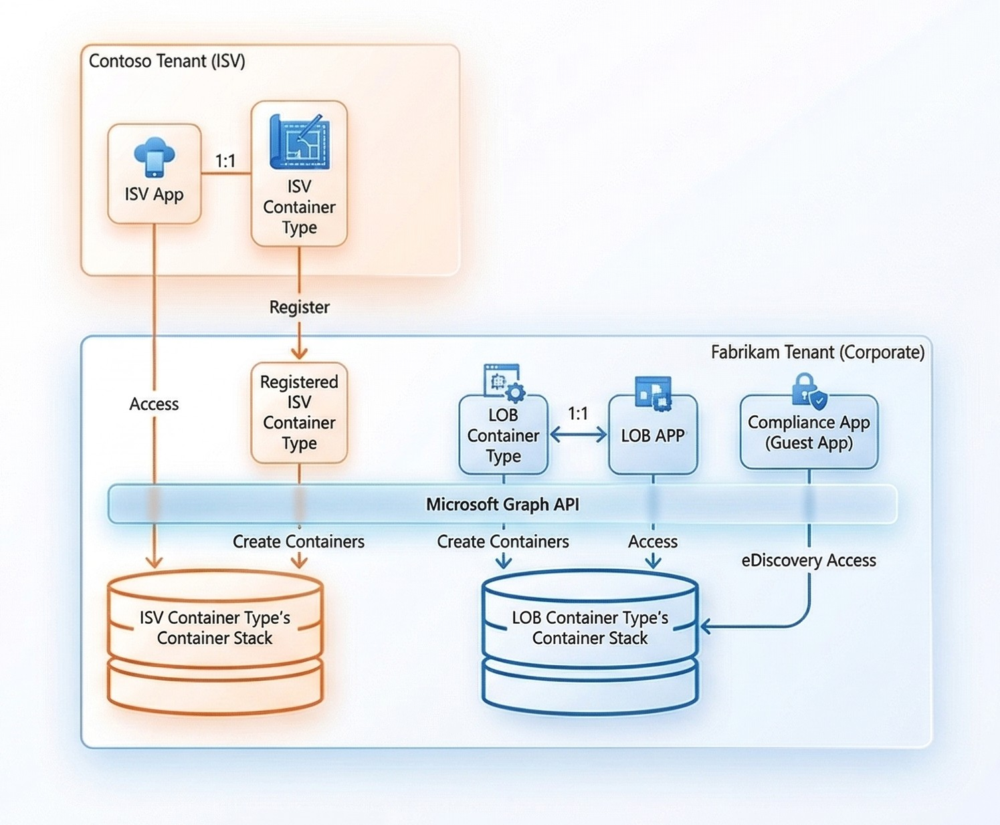
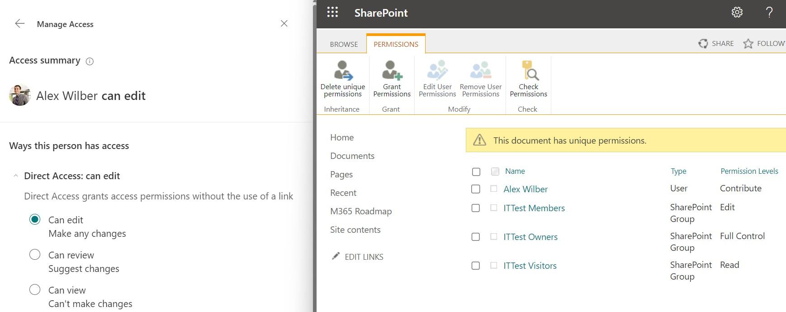

# SharePoint Embedded 核心概念指南

本文档帮助开发人员，管理员在 **5-10 分钟** 内建立对 SharePoint Embedded（以下简称 SPE）的整体认知：它是什么、解决什么问题、关键对象之间如何协作、权限与计费如何运作、以及落地实施需要关注的关键步骤。

---

## 目录

1. [一句话理解 SPE](#1-一句话理解-spe)
2. [核心概念与对象关系](#2-核心概念与对象关系)
3. [架构与租户模型](#3-架构与租户模型)
4. [认证与授权](#4-认证与授权)
5. [共享与权限管理](#5-共享与权限管理)
6. [Container Type 与计费](#6-container-type-与计费)
7. [实施路径速览](#7-实施路径速览)
8. [与普通 SharePoint 的关键区别](#8-与普通-sharepoint-的关键区别)
9. [常见误区](#9-常见误区)
10. [术语速查表](#10-术语速查表)
11. [扩展阅读地图](#11-扩展阅读地图)

---

## 1. 一句话理解 SPE

**SharePoint Embedded 是一个纯 API 驱动的文件与文档管理平台。** 它把 Microsoft 365 存储、协作、合规能力"嵌入"到你自己的 App 中，但不暴露任何 SharePoint 站点界面，即 **无界面 SharePoint**。

类比理解：

| 传统 SharePoint                                                                  | SharePoint Embedded                                                                           |
| -------------------------------------------------------------------------------- | --------------------------------------------------------------------------------------------- |
| 你在 SharePoint 站点里创建"文档库（Document Library）"，用户通过站点 UI 访问文件 | 你的 App 通过 Microsoft Graph 创建 "Container（容器）"，用户通过你的 App UI 访问文件          |
| 文件和站点都在同一租户内，由 SharePoint 管理员统一管理                           | 文件仍在客户的 M365 租户内，但存放在一个独立分区（Partition），与 SharePoint 站点存储互不影响 |

> **关键点：** SPE 中的文档始终驻留在客户（消费方）的 M365 租户，开发者的 App 只负责"读写"而非"持有"数据。

---

## 2. 核心概念与对象关系

SPE 体系中有几个必须理解的核心对象，下面用一张层级关系帮你快速建立心智模型：

```
Owning Tenant（开发租户）
  └── Application（应用，Entra ID 注册）
        └── Container Type（容器类型，1:1 绑定 Owning App ）
              └── [部署到 Consuming Tenant]
                    └── Container（容器实例，可创建多个）
                          ├── Files / Folders（文件与文件夹）
                          └── Permissions（成员与角色）
```

### 核心对象速解

- **Container（容器）**：SPE 最基本的存储单元，也是安全与合规的边界。可以类比为一个"仅通过 API 访问的 Document Library"。每个 Container 可以独立设置成员权限，存储多层级文件和文件夹。

- **Container Type（容器类型）**：Container 的配置**模板**：

  - **访问授权**：规定哪些 App 可以访问该类型的 Container。每个 Container 实例都携带一个不可变的 `ContainerTypeID` 属性，用于在整个 SPE 识别其所属 Container Type。

  - **计费归属**：决定账单由谁承担。`trial` ，`standard` ，`directToCustomer` 三种计费模式。
  - **行为配置**：Container Type 可以设置该类型下所有 [Container 的属性](https://learn.microsoft.com/en-us/graph/api/resources/filestoragecontainertypesettings)，如共享模式、存储上限、可发现性等。

- **Application（应用）**：分为 Owning Application 和 Guest Application 两种角色：

  - **Owning Application（拥有应用）**：与 Container Type **1:1 强绑定**，是其创建者和管理者，默认对该 Container Type 下所有 Container 拥有最高权限，并负责声明所需的 Graph 权限（如 `FileStorageContainer.Selected`）。

  - **Guest Application（来宾应用）**：其他一般 App，经 Owning Application 授权后可访问其管理的 Container，适用于跨 App 场景（如监控工具可被授权访问 Container 里的文件）。

---

## 3. 架构与租户模型

### Owning Tenant 与 Consuming Tenant

SPE 引入了两个关键租户角色：

- **Owning Tenant（拥有租户/开发租户）**：开发并管理 App 和 Container Type 的租户。通常就是 ISV 或企业开发团队所在的 M365 租户。
- **Consuming Tenant（消费租户/客户租户）**：实际使用 App、存储文件的租户。所有 Container 和内容都存储在 Consuming Tenant 内部。

### Container Type Registration（容器类型注册）

- Container Type 作为 **模板**，仅存在 Owning Tenant 中，由开发商管理。
- 部署到客户 Consuming Tenant 时，注册后的 **实例** 就是 Container Type Registration（可类比 AAD 中 App Registration 和 Service Principal 的关系）。
- 它的主要作用是：
  - 承载 App 对 Container Type 下所有 Container 的访问权限，包括 owning 和 guest app。
  - 若设置允许，可覆盖 Container Type 的默认 settings，参见 [fileStorageContainerTypeRegistration](https://learn.microsoft.com/en-us/graph/api/resources/filestoragecontainertyperegistration)
  - direct to customer 计费模式下，绑定客户租户的计费信息。

> 同一个租户可以同时充当 Owning Tenant 和 Consuming Tenant（例如企业内部自建 LOB App 的场景）。此时 Owning Application 可以是 Single Tenant 的。
>
> Tenant 不同时，Owning Application 必须是 Multi Tenant 的。部署时，首先得在 Consuming Tenant 安装 Owning app 的 service principal 以及必要 consent，然后才能注册 Container Type。

#### 场景示例

> Contoso（ISV）开发了一款 ISV App，部署到 Fabrikam 的租户。Fabrikam 同时也自建了一个 LOB App。
>
> Contoso 是 ISV App 的 Owning Tenant，Fabrikam 既是 ISV App 的 Consuming Tenant，也是 LOB App 的 Owning + Consuming Tenant。
>
> 两个 App 各自创建 1:1 绑定的 Container Type，然后注册到 Consuming Tenant ( LOB Container Type 创建和注册在同一 Tenant )。
>
> Compliance App，一个不带 Container Type 的 Guest Application，被授权访问 LOB App 的 Container 来扫描文件合规状态。
>
> 

---

## 4. 认证与授权

SPE 的认证授权体系分为 **三层**，理解这三层之间的关系是避免权限问题的关键。

### 第一层：Microsoft Graph API 权限 (APP 权限1)

App 需要在 Azure AD App Registration 中声明以下核心 Graph API 权限：

| 权限                                   | 用途                                    | 需要时机                          |
| -------------------------------------- | --------------------------------------- | --------------------------------- |
| `FileStorageContainerType.Manage.All`  | 创建和管理 Container Type               | 仅在 Owning Tenant 上需要         |
| `FileStorageContainerTypeReg.Selected` | 在 Consuming Tenant 注册 Container Type | 部署到客户租户时                  |
| `FileStorageContainer.Selected`        | 访问 Container 和内容                   | Owning 和 Consuming Tenant 都需要 |

> **注意：** 创建 Container Type 后，应移除 `FileStorageContainerType.Manage.All`，避免客户对过度权限的担忧。

### 第二层：Container Type 权限 (APP 权限2)

通过 Container Type Registration API 注册后，生成 Container Type Registration，决定了 App 对Container Type下所有 Container 能做的操作。常用权限如下：
| 权限 | 说明 |
| ------------------------------ | -------------------- |
| `ReadContent` / `WriteContent` | 读/写 Container 内容 |
| `Create` / `Delete` | 创建/删除 Container |
| `ManagePermissions` | 管理 Container 成员 |
| `Full` | 拥有全部权限 |

> Graph API 权限 + Container Type 权限的 **交集** 才构成完整的 **App 权限**。

### 第三层：Container 权限（用户权限）

当 App 代表用户（Delegated/委托模式）访问 Container 时，用户必须是该 Container 的成员。可授予以下权限：

| 角色        | 能力范围                                 |
| ----------- | ---------------------------------------- |
| **Reader**  | 只读 Container 属性和内容                |
| **Writer**  | Reader 的全部能力 + 创建、更新、删除内容 |
| **Manager** | Writer 的全部能力 + 管理 Container 成员  |
| **Owner**   | Manager 的全部能力 + 删除 Container      |

> 通过 Delegated 调用创建 Container 的用户会被自动分配 Owner 角色。

### 两种访问模式

- **Delegated（委托/用户代理）**：推荐方式。 App 代表登录用户操作，有效权限 = App 权限 ∩ 用户权限。可审计到具体用户。
- **App-only（纯应用）**： App 使用 Service Principal 直接操作，**不受 Container 权限限制**。适合后台任务，但审计粒度较低。

> 文档中还有一种 [Container Type Owner](https://learn.microsoft.com/en-us/sharepoint/dev/embedded/development/auth#container-type-owner-capabilities)的角色，当开发者用 Delegated 方式创建 Container Type 时，创建者会自动成为 Container Type Owner。可以理解为**模板管理员**，可授予3人，仅在 Owning Tenant 有意义。

---

## 5. 共享与权限管理

### 权限继承与 Additive Permission

Container 内的内容默认继承父级权限（Container → Folder → File），这个继承链 **不可打破**。但可以通过 Additive Permission（附加权限）给特定文件或文件夹添加额外权限。

> 经研究，这其实类似普通 SharePoint Library里，文件的 **Direct Access 权限** (如下图，用户会被添加到文件的访问列表中)，但区别在于，这个权限继承在 SPE 中是不会断开的
>
> 
>
> 其次， **没有** 文档表示 SPE 支持 **Shareable Link**。
>
> Note: 经验证，用 createLink API 去创建 link 会报错。

具体操作，使用 driveItem 的 [invite](https://learn.microsoft.com/en-us/graph/api/driveitem-invite?view=graph-rest-1.0&tabs=http) 为文件文件夹添加权限。

经实测，

1. 可以仅共享单个文件，而无需授予用户 Container 访问权限。
2. 用户仍须通过 App 访问（上文已提过，SPE中的权限必须是 App 权限 ∩ 用户权限）。比如只共享了一个文件，那访问 container 就只能看到这个文件，这与普通 SharePoint 是一致的。

**限制：** 不能对 Container 本身添加 Additive Permission（这相当于直接修改角色了），且只能通过 Delegated 模式设置。

### 谁能给文件添加 Additive Permission?

文档中有说明 Open 和 Restrictive 两种模式，实际对应了 Container Type 中 isSharingRestricted 属性：

| 属性值    | 谁能给文件添加新权限     |
| --------- | ------------------------ |
| **false** | 任何拥有编辑权限的成员   |
| **true**  | 仅 Owner 和 Manager 角色 |

### External Sharing（外部共享）

SPE App 默认继承 Consuming Tenant 的 SharePoint全局策略。但管理员可以通过 `Set-SPOApplication` 为某个 SPE App 单独配置不同的外部共享策略——即使全局禁止访客共享，也可以让特定 App 允许。

---

## 6. Container Type 与计费

### 三种 Container Type

| 类型            | billingClassification 属性值 | 适用场景             | 关键限制                                               |
| --------------- | ---------------------------- | -------------------- | ------------------------------------------------------ |
| **Trial**       | `trial`                      | 开发验证与功能评估   | 最多 5 个 Container ，每个 1 GB，30 天过期，仅限本租户 |
| **Standard**    | `standard`                   | 生产环境（ISV 付费） | 费用由 Owning Tenant 的 Azure 订阅承担                 |
| **Passthrough** | `directToCustomer`           | 生产环境（客户付费） | 费用由 Consuming Tenant 的 Azure 订阅承担              |

- 每个租户最多可同时拥有 **25 个** Standard Container Type。
- 一个 App 只能拥有 **1 个** Container Type（1:1 绑定）。
- 三种类型互相不可转换。

### 计费模型

SPE 采用 Pay-as-you-go（按量付费）模式，按以下维度计量：

- Storage: $0.00667 per GB/day ($0.20 per GB/month)

- Graph API transactions: $0.0005 per API call

- Egress: $0.05 per GB

> SPE 的存储 **不占用** 客户已有的 M365 SharePoint 存储配额，而是通过 Azure 订阅独立计费。目前 SharePoint Online 在全球版中，额外存储也是 $0.20 per GB/month，所以如果能买到增加SPO存储的 Add-on，仅供内部使用的 app， 显然是搭建在 SPO 更划算。（但 21v 没有这样的 Add-on）

### 标准计费设置流程

对于 Standard Container Type，Owning Tenant 管理员需要：

1. 准备一个 Azure 订阅 + 资源组
2. 创建 Container Type 后，通过 PowerShell 绑定计费：

```powershell
Add-SPOContainerTypeBilling –ContainerTypeId <ID> -AzureSubscriptionId <SubId> -ResourceGroup <RG> -Region <Region>
```

对于 Passthrough Container Type，参考 [官方文档](https://learn.microsoft.com/en-us/sharepoint/dev/embedded/administration/consuming-tenant-admin/cta#set-up-billing-for-passthrough-container-type) 在 M365 Admin Center 设置计费。

---

## 7. 实施路径速览

> 完整 App 开发和部署流程，参见 [官方教程](https://learn.microsoft.com/en-us/training/modules/sharepoint-embedded-create-app/)

以下是从零到上线的关键步骤：

### 阶段一：开发准备

1. 在 Azure AD 中注册 App，配置所需 Graph 权限
2. 在 Owning Tenant 创建 Container Type（Trial 即可快速验证）
3. 在本地注册 Container Type

> 国际版推荐使用 [SPE VS Code Extension](https://learn.microsoft.com/en-us/sharepoint/dev/embedded/getting-started/spembedded-for-vscode) 快速完成以上步骤。
>
> 21v 版则使用官方提供的 [Postman Collection](https://github.com/microsoft/SharePoint-Embedded-Samples/tree/main/Postman) 进行 API 调用。**待验证，或许须改url**

### 阶段二： 代码开发

4. 通过 Microsoft Graph API 实现Container的创建、查询、文件操作
5. 使用 MSAL（Microsoft Authentication Library）处理认证流程
6. 实现 OBO（On-Behalf-Of）流程让后端代表用户调用 Graph API

### 阶段三：部署上线

7. 将应用清单权限调整为 Consuming Tenant 所需的最小集（移除 `FileStorageContainerType.Manage.All`）
8. 在 Consuming Tenant 上获取管理员 Admin Consent
9. 调用 Container Type Registration API 注册 Container Type
10. 如为 Passthrough 计费，引导客户管理员在 M365 Admin Center 设置计费

---

## 8. 与普通 SharePoint 的关键区别

| 维度           | 普通 SharePoint                         | SharePoint Embedded                                           |
| -------------- | --------------------------------------- | ------------------------------------------------------------- |
| **访问方式**   | 站点 UI + API 双通道                    | 纯 API（Microsoft Graph），无站点 UI                          |
| **方案架构**   | SharePoint Site → Document Library      | Application → Container Type → Container                      |
| **存储配额**   | 计入 M365 SharePoint 配额               | 独立按量计费，不占 M365 配额                                  |
| **权限管理**   | Site 级、Library 级、Item 级权限 + Link | Graph，Container Type，Container 级权限 + Additive Permission |
| **合规能力**   | 全部 M365 Purview 能力                  | 同样享有 eDiscovery、DLP、审计、保留策略、敏感度标签等        |
| **协作**       | Office Online + Desktop 完整体验        | 同样支持                                                      |
| **管理员**     | SharePoint Administrator                | SharePoint Embedded Administrator                             |
| **用户许可证** | 访问者通常需要 M365 许可证              | 访问者通常 **不需要** M365 许可证（少数操作例外）             |

> **核心差异总结：** SPE 把 SharePoint 的"存储 + 协作 + 合规"能力解耦出来，以纯 API 的姿态嵌入到你自己的 App 中，同时保证数据始终驻留在客户租户内。

---

## 9. 常见误区

| 误区                                                      | 事实                                                                                                                              |
| --------------------------------------------------------- | --------------------------------------------------------------------------------------------------------------------------------- |
| "SPE 的文件存在开发者的租户里"                            | 文件 **始终** 存储在 Consuming Tenant（客户租户），开发者的 App 只有 API 访问权，不持有数据                                       |
| "一个 App 可以创建多个 Container Type"                    | App 与 Container Type 是严格 1:1 关系                                                                                             |
| "Trial Container Type 可以升级为 Standard"                | 不可以。Trial 过期后必须删除，重新创建 Standard Container Type                                                                    |
| "纯应用模式（App-only）的权限和代理模式（Delegated）一样" | App-only 获得 Container Type 级别的全部权限，不受 Container 权限限制；Delegated 的有效权限是 App 权限和 Container 权限的 **交集** |
| "SPE 存储算在 M365 的 SharePoint 配额里"                  | SPE 有独立的 Azure 按量计费，不计入 M365 SharePoint 存储配额                                                                      |
| "用户需要 Office 许可证才能在 SPE 中协作"                 | 大多数操作 **不需要** Office 许可证。但 @mentions 人员选择器、List containers（代理模式）等少数功能目前仍依赖许可证               |

---

## 10. 术语速查表

以下是本文档涉及的核心术语，首次出现时附中文释义：

| 术语                      | 中文释义          | 简要说明                                      |
| ------------------------- | ----------------- | --------------------------------------------- |
| SharePoint Embedded (SPE) | SharePoint 嵌入式 | 微软纯 API 文件管理平台                       |
| Container                 | 容器              | SPE 最小存储与安全边界单元                    |
| Container Type            | 容器类型          | 定义应用与 Container 集合之间关系的资源       |
| Owning Tenant             | 拥有租户/开发租户 | 创建 Container Type 的租户                    |
| Consuming Tenant          | 消费租户/客户租户 | 使用应用、存储文件的租户                      |
| Owning Application        | 拥有应用          | 创建和管理 Container Type 的 Azure AD 应用    |
| Guest Application         | 来宾应用          | 被授权访问他人 Container Type 的应用          |
| Microsoft Graph           | N/A               | 微软云统一 API 网关，SPE 所有操作的 API 入口  |
| Delegated (access)        | 委托访问/用户代理 | 应用代表登录用户操作                          |
| App-only (access)         | 纯应用访问        | 应用用自身身份直接操作                        |
| OBO (On-Behalf-Of)        | 代理流程          | 后端用前端令牌换取 Graph 令牌的认证模式       |
| Additive Permission       | 附加权限          | 在继承权限之上为特定文件/文件夹扩展的额外权限 |
| Admin Consent             | 管理员同意        | 租户管理员批准应用所请求的权限                |
| PAYG (Pay-as-you-go)      | 按量付费          | SPE 的计费模式                                |

---

## 11. 扩展阅读地图

按主题分组的官方文档导航，方便你按需深入：

### 入门与总览

- [Overview of SharePoint Embedded](https://learn.microsoft.com/en-us/sharepoint/dev/embedded/overview)
- [SharePoint Embedded app architecture](https://learn.microsoft.com/en-us/sharepoint/dev/embedded/development/app-architecture)
- [SharePoint Embedded for VS Code（快速试玩）](https://learn.microsoft.com/en-us/sharepoint/dev/embedded/getting-started/spembedded-for-vscode)

### 认证与权限

- [Authentication and authorization](https://learn.microsoft.com/en-us/sharepoint/dev/embedded/development/auth)
- [Sharing and permissions](https://learn.microsoft.com/en-us/sharepoint/dev/embedded/development/sharing-and-perm)
- [Register container type application permissions](https://learn.microsoft.com/en-us/sharepoint/dev/embedded/getting-started/register-api-documentation)

### Container Type 与计费

- [Container types](https://learn.microsoft.com/en-us/sharepoint/dev/embedded/getting-started/containertypes)
- [Billing models](https://learn.microsoft.com/en-us/sharepoint/dev/embedded/administration/billing/billing)
- [Limits and calling patterns](https://learn.microsoft.com/en-us/sharepoint/dev/embedded/development/limits-calling)

### 管理与运维

- [Developer Admin](https://learn.microsoft.com/en-us/sharepoint/dev/embedded/administration/developer-admin/dev-admin)
- [Consuming Tenant Admin](https://learn.microsoft.com/en-us/sharepoint/dev/embedded/administration/consuming-tenant-admin/cta)
- [Container management in PowerShell](https://learn.microsoft.com/en-us/sharepoint/dev/embedded/administration/consuming-tenant-admin/ctapowershell)
- [Container management in SharePoint Admin Center](https://learn.microsoft.com/en-us/sharepoint/dev/embedded/administration/consuming-tenant-admin/ctaUX)

### 开发教程

- [Microsoft Learning: SPE overview & configuration](https://learn.microsoft.com/en-us/training/modules/sharepoint-embedded-setup)
- [Microsoft Learning: SPE building applications](https://learn.microsoft.com/en-us/training/modules/sharepoint-embedded-create-app)
