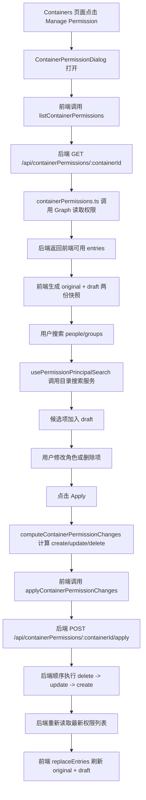

# Container Permission 模块 README

本文档面向初级程序员，目标不是只告诉你“这个模块能做什么”，而是带你顺着代码真正看懂它的完整 workflow：前端怎么组织状态，什么时候调用后端，后端又是怎样把请求翻译成 Microsoft Graph 的容器权限操作。

## 1. 这个模块解决什么问题

`Container Permission` 模块用于管理某个 `fileStorageContainer` 的访问权限。用户在前端弹窗里可以：

- 查看当前容器已经有哪些 `people` 和 `groups`
- 搜索新的用户或组并加入权限列表
- 修改已有权限项的角色
- 删除已有权限项
- 点击 `Apply` 后，把差异提交给后端，再由后端写回 Microsoft Graph

这个模块有一个非常重要的设计思想：

- 前端不直接操作 Microsoft Graph
- 前端只维护“本地草稿”和“准备提交的差异”
- 真正的权限读取与写回，都通过后端统一处理

这样做的好处是：

- 前端代码更容易理解，不需要直接面对 Graph 细节
- 后端可以统一做鉴权、错误映射、角色映射和请求保护
- 初级开发者调试时，能把问题拆成“前端草稿逻辑”与“后端写回逻辑”两段来看

---

## 2. 模块文件地图

## 前端：`src/components/permissions`

### `index.ts`

模块出口文件。它只做一件事：把 `ContainerPermissionDialog` 暴露给外部页面使用。

你可以把它理解成“权限模块的大门”。

### `ContainerPermissionDialog.tsx`

这是前端权限模块的总装配文件，也是最值得先读的文件。

它主要负责：

- 渲染权限弹窗外壳
- 组织 `People / Groups` 两个 `Tab`
- 在弹窗打开时读取当前容器权限
- 调用搜索 Hook 管理目录搜索交互
- 调用草稿状态 Hook 管理本地编辑
- 在点击 `Apply` 时计算差异并提交给后端

可以把它理解成前端的“小型 controller”。

### `hooks/useContainerPermissionDialogState.ts`

这个 Hook 负责“弹窗级状态编排”。

它把几件事情收口到一起：

- 当前选中了哪个 `Tab`
- 每个 `Tab` 各自的搜索输入值
- 当前草稿里的权限列表
- 往草稿里新增候选人
- 修改角色
- 删除权限项
- 放弃草稿并关闭弹窗

它的价值是：让 `ContainerPermissionDialog.tsx` 不必同时管理太多零散状态。

### `hooks/usePermissionDraft.ts`

这个 Hook 专门管理“原始权限快照”和“正在编辑的草稿快照”。

它内部维护两份数据：

- `originalEntriesByTab`：最近一次确认成功的基线
- `draftEntriesByTab`：用户当前正在编辑的内容

为什么一定要分两份：

- 点 `Close` 时，要能回滚到原始状态
- 点 `Apply` 成功后，要能把最新服务端结果变成新的基线
- 切换到另一个容器时，要能整体重置

这就是典型的“草稿编辑模型”。

### `hooks/usePermissionPrincipalSearch.ts`

这个 Hook 专门负责“搜索目录主体”的完整交互链路。

它负责：

- 维护当前搜索词
- 最少输入 `3` 个字符后才允许搜索
- `debounce`
- 调用目录搜索服务
- 处理 `loading / success / empty / error`
- 处理重复添加提示
- 用户选中候选项后，把它加入本地草稿列表

注意：它只负责“找人 / 找组”和“把候选项送进草稿”，并不直接负责真正的权限写回。

### `hooks/usePermissionTabs.ts`

一个很小的 Hook，用来维护当前选中的 `people` 或 `groups` 标签。

### `models/permissionModels.ts`

这个文件定义权限模块的核心前端数据模型，比如：

- `PermissionTabValue`
- `ContainerPermissionRole`
- `IPermissionPrincipalCandidate`
- `IContainerPermissionEntry`
- `PermissionEntriesByTab`

如果你想快速搞清楚“前端到底在传什么数据”，这个文件非常值得先读。

### `permissionsTypes.ts`

定义 `ContainerPermissionDialog` 的外部参数类型。

比如：

- 是否打开弹窗
- 当前容器 `id`
- 当前容器名称
- 关闭回调

### `permissionsStyles.ts`

权限弹窗自己的样式文件。

它不参与业务逻辑，但能帮助你理解 UI 是怎样被分区的，比如搜索区、列表区、按钮区。

### `services/containerPermissionApi.ts`

前端访问后端权限 API 的适配层。

它主要做三件事：

- `listContainerPermissions(containerId)`：读取当前容器权限
- `applyContainerPermissionChanges(containerId, changes)`：提交差异并获取刷新后的最新列表
- 把后端错误包装成稳定的 `ContainerPermissionApiError`

你可以把它理解成“前端访问后端的唯一入口”。

### `services/containerPermissionDiff.ts`

这个文件非常关键。它负责比较：

- 原始快照 `originalEntriesByTab`
- 当前草稿 `draftEntriesByTab`

最后产出三类差异：

- `create`
- `update`
- `delete`

前端不会把整张表重新提交给后端，而是只提交这三类差异。

### `services/permissionPrincipalCandidateMapper.ts`

把目录搜索服务返回的结果，映射成权限模块可直接消费的候选项模型。

它的作用是把“搜索结果结构”和“权限弹窗显示结构”解耦。

### `services/directoryPrincipalSearch/*`

这是目录搜索服务层。

它负责：

- 构造 Microsoft Graph 搜索计划
- 处理查询策略
- 统一缓存
- 统一错误处理
- 把 Graph 返回的目录对象整理成标准结果

注意，这一层服务的是“目录搜索”，不是“容器权限写回”。

---

## 后端：`server`

### `containerPermissionRoleMapper.ts`

这个文件负责“角色翻译”。

因为：

- 前端下拉框使用的是更易读的 `Reader / Writer / Manager / Owner`
- Microsoft Graph 返回和写回时使用的是小写角色，例如 `reader / writer / manager / owner`
- Graph 还可能返回特殊值 `principalOwner`

这个文件做了两种映射：

- `mapGraphContainerPermissionRoleToUi`：Graph -> 前端 UI
- `mapUiContainerPermissionRoleToGraph`：前端 UI -> Graph

如果没有这层映射，前端和后端都会散落很多角色转换细节。

### `containerPermissionsError.ts`

这个文件负责统一处理后端权限模块的错误。

它主要做三件事：

- 把未知的 Graph 错误映射成稳定的业务错误类型
- 生成统一的 API 错误响应体
- 根据错误类型选择合适的 HTTP 状态码

它解决的问题是：前端不需要理解各种原始 Graph 错误对象结构，只需要消费稳定的错误响应。

### `containerPermissions.ts`

这是后端权限模块的核心业务文件。

它主要负责：

- 处理读取容器权限的请求
- 处理应用权限差异的请求
- 调用鉴权逻辑
- 创建 Graph client
- 从 Graph 读取权限并映射成前端模型
- 按顺序执行删除、更新、创建
- 把错误映射成稳定响应

这个文件相当于后端权限模块的主业务实现。

### `index.ts`

后端入口文件里注册了权限相关路由：

- `GET /api/containerPermissions/:containerId`
- `POST /api/containerPermissions/:containerId/apply`

它的作用不是写业务细节，而是把 HTTP 路由接到 `containerPermissions.ts`。

---

## 3. 整体 workflow 总览

下面这张图先帮你建立全局印象：



建议你第一次读代码时，就按这张图的顺序走。

---

## 4. 从页面入口开始：弹窗是怎么被打开的

这条链路的起点不在 `permissions` 目录里，而在容器页面：

- 文件：`src/components/containers/index.tsx`
- 关键点：点击 `Manage Permission` 按钮时，执行 `setIsPermissionDialogOpen(true)`
- 然后把 `open`、`containerId`、`containerName` 传给 `<ContainerPermissionDialog />`

也就是说：

1. 容器页面先决定“当前是哪一个容器”
2. 再把这个容器的信息交给权限弹窗
3. 权限弹窗内部再去读取和编辑这个容器的权限

这是一个很好的分层：

- 页面层负责“我现在在管理哪个容器”
- 权限模块负责“怎么管理这个容器的权限”

---

## 5. Code Walkthrough 一：打开弹窗并加载现有权限

下面我们按真实调用链走一遍。

### 第 1 步：容器页面打开弹窗

文件：`src/components/containers/index.tsx`

关键代码职责：

- 按钮点击后打开权限弹窗
- 把当前容器 `id` 和 `displayName` 传进去

这里的重点不是业务，而是“选中的容器上下文”被传进了权限模块。

```tsx
const [selectedContainer, setSelectedContainer] = useState<
  IContainer | undefined
>(undefined);
const [isPermissionDialogOpen, setIsPermissionDialogOpen] = useState(false);

<Button
  appearance="primary"
  disabled={!selectedContainer}
  onClick={() => setIsPermissionDialogOpen(true)}
>
  Manage Permission
</Button>

<ContainerPermissionDialog
  open={isPermissionDialogOpen}
  containerId={selectedContainer?.id}
  containerName={selectedContainer?.displayName}
  onClose={() => setIsPermissionDialogOpen(false)}
/>
```

### 第 2 步：`ContainerPermissionDialog` 监听 `open` 和 `containerId`

文件：`src/components/permissions/ContainerPermissionDialog.tsx`

关键代码：

- `useEffect(... [open, containerId])`
- 打开时调用 `listContainerPermissions(containerId)`
- 成功后执行 `replaceEntries(entriesByTab)`
- 失败后显示 `permissionRequestErrorMessage`

你可以把这一步理解为：

- 弹窗一打开，不是立刻让用户在空表上编辑
- 而是先去后端读取“当前真实权限”
- 读取成功后，把它同时作为 `original` 和 `draft` 的起点

```tsx
useEffect(() => {
  if (!open) {
    return;
  }

  if (!containerId) {
    replaceEntries(createEmptyPermissionEntries());
    setPermissionRequestErrorMessage("No container selected.");
    return;
  }

  let cancelled = false;

  void listContainerPermissions(containerId)
    .then((entriesByTab) => {
      if (cancelled) {
        return;
      }

      replaceEntries(entriesByTab);
    })
    .catch((error: unknown) => {
      if (cancelled) {
        return;
      }

      replaceEntries(createEmptyPermissionEntries());
      setPermissionRequestErrorMessage(
        getPermissionRequestErrorMessage(
          error,
          "Unable to load current container permissions.",
        ),
      );
    });

  return () => {
    cancelled = true;
  };
}, [open, containerId]);
```

### 第 3 步：前端 API 层发起请求

文件：`src/components/permissions/services/containerPermissionApi.ts`

关键函数：

- `listContainerPermissions`
- `sendAuthorizedRequest`

这里做了两件事：

- 从 `SpEmbedded` 取后端 API token
- 请求 `GET /api/containerPermissions/:containerId`

也就是说，前端不是直接访问 Graph，而是先访问自己的后端。

```ts
export const listContainerPermissions = async (
  containerId: string,
): Promise<PermissionEntriesByTab> => {
  const response = await sendAuthorizedRequest(
    `/api/containerPermissions/${encodeURIComponent(containerId)}`,
    {
      method: "GET",
    },
  );

  const payload = (await response.json()) as IContainerPermissionsResponse;
  return mapEntriesToTabs(payload.entries);
};
```

### 第 4 步：后端路由接住请求

文件：`server/index.ts`

关键路由：

- `server.get("/api/containerPermissions/:containerId", ...)`

它会把请求转给：

- 文件：`server/containerPermissions.ts`
- 函数：`listContainerPermissions`

```ts
server.get("/api/containerPermissions/:containerId", async (req, res) => {
  try {
    await listContainerPermissions(req, res);
  } catch (error: unknown) {
    const msg = error instanceof Error ? error.message : String(error);
    res.send(500, { message: `Error in listContainerPermissions: ${msg}` });
  }
});
```

### 第 5 步：后端鉴权并创建 Graph client

文件：`server/containerPermissions.ts`

关键函数：

- `authorizeContainerManageRequest(req)`
- `getGraphToken(authorizationResult.token)`
- `createGraphClient(graphToken)`

这一段的作用是：

- 先确认当前请求是否有权限管理容器
- 再把当前请求上下文转换成可调用 Graph 的 client

这也是前端不直接访问 Graph 的原因之一：鉴权细节放在后端更安全。

```ts
export const listContainerPermissions = async (
  req: Request,
  res: Response,
) => {
  const authorizationResult = await authorizeContainerManageRequest(req);

  if (!authorizationResult.ok) {
    res.send(authorizationResult.status, authorizationResult.body);
    return;
  }

  const containerId = readContainerId(req);
  const graphToken = await getGraphToken(authorizationResult.token);
  const graphClient = createGraphClient(graphToken) as unknown as IGraphClient;
  const entries = await fetchContainerPermissionEntries(graphClient, containerId);

  res.send(200, { entries });
};
```

### 第 6 步：后端从 Graph 读取权限

文件：`server/containerPermissions.ts`

关键函数：

- `fetchContainerPermissionEntries`
- `getContainerPermissionsPath(containerId)`
- `mapGraphPermissionToEntry`

这里会：

1. 调用 Graph 获取某个容器的权限列表
2. 把 Graph 返回的原始权限对象，映射成前端表格能直接消费的 `entry`

`mapGraphPermissionToEntry` 里做了很多重要收敛：

- 提取 `permissionId`
- 识别当前条目是 `people` 还是 `groups`
- 提取主体名字、描述、`principalId`
- 使用 `mapGraphContainerPermissionRoleToUi` 把 Graph 角色翻译成前端角色

```ts
export const fetchContainerPermissionEntries = async (
  graphClient: IGraphClient,
  containerId: string,
): Promise<IContainerPermissionEntryDto[]> => {
  try {
    const response = await graphClient
      .api(getContainerPermissionsPath(containerId))
      .version("v1.0")
      .get();

    const responseRecord = readRecord(response);
    const permissionItems = responseRecord.value;

    if (!Array.isArray(permissionItems)) {
      return [];
    }

    return permissionItems.map(mapGraphPermissionToEntry);
  } catch (error: unknown) {
    throw mapContainerPermissionsGraphError(error);
  }
};
```

```ts
const mapGraphPermissionToEntry = (
  permission: unknown,
): IContainerPermissionEntryDto => {
  const permissionRecord = readRecord(permission);
  const permissionId = readRequiredString(permissionRecord.id, "permission id");
  const roles = readStringArray(permissionRecord.roles);
  const grantedToV2 = readRecord(permissionRecord.grantedToV2);
  const principal =
    readGraphPermissionIdentity(grantedToV2.user) ??
    readGraphPermissionIdentity(grantedToV2.siteUser) ??
    readGraphPermissionIdentity(grantedToV2.group) ??
    readGraphPermissionIdentity(grantedToV2.siteGroup);

  const principalType =
    grantedToV2.user || grantedToV2.siteUser ? "people" : "groups";
  const primaryRole = roles[0] ?? "reader";

  return {
    id: `permission:${permissionId}`,
    permissionId,
    principalId: principal.graphId ?? createFallbackPrincipalId(principalType, permissionId, principal),
    principalLookupKey: principal.lookupKey,
    principalUserPrincipalName: principal.userPrincipalName,
    principalName: principal.displayName,
    principalType,
    description: principal.description,
    role: mapGraphContainerPermissionRoleToUi(primaryRole),
  };
};
```

### 第 7 步：后端返回前端统一模型

文件：`server/containerPermissions.ts`

关键数据结构：

- `IContainerPermissionEntryDto`
- `IContainerPermissionsResponse`

前端拿到的是“已经被整理好的权限项数组”，而不是 Graph 原始结构。

```ts
interface IContainerPermissionEntryDto {
  id: string;
  permissionId: string;
  principalId: string;
  principalLookupKey?: string;
  principalUserPrincipalName?: string;
  principalName: string;
  principalType: PermissionTabValue;
  description: string;
  role: ContainerPermissionUiRole;
}

interface IContainerPermissionsResponse {
  entries: IContainerPermissionEntryDto[];
}
```

### 第 8 步：前端建立草稿基线

文件：`src/components/permissions/hooks/usePermissionDraft.ts`

关键函数：

- `replaceEntries`

这一步会把服务端返回的最新权限：

- 设为 `originalEntriesByTab`
- 同时复制一份到 `draftEntriesByTab`

从这里开始，用户后续所有编辑都只改 `draft`。

```ts
const [originalEntriesByTab, setOriginalEntriesByTab] = useState(
  cloneEntriesByTab(initialEntriesByTab),
);
const [draftEntriesByTab, setDraftEntriesByTab] = useState(
  cloneEntriesByTab(initialEntriesByTab),
);

const replaceEntries = (entriesByTab: PermissionEntriesByTab) => {
  const nextOriginalEntriesByTab = cloneEntriesByTab(entriesByTab);
  setOriginalEntriesByTab(nextOriginalEntriesByTab);
  setDraftEntriesByTab(cloneEntriesByTab(nextOriginalEntriesByTab));
};
```

---

## 6. Code Walkthrough 二：添加一个新用户或新组

这个例子非常重要，因为它涉及前端搜索、候选项映射、本地草稿，以及后端真正创建权限。

### 第 1 步：用户在弹窗输入搜索词

文件：`src/components/permissions/ContainerPermissionDialog.tsx`

关键点：

- 搜索框的输入事件最终交给 `handleQueryChange`
- 这些逻辑由 `usePermissionPrincipalSearch` 接管

```tsx
const handleComboboxChange: NonNullable<ComboboxProps["onChange"]> = (
  event,
) => {
  handleQueryChange(event.target.value);
};

<Combobox
  value={query}
  open={isDropdownOpen && !interactionDisabled}
  onChange={handleComboboxChange}
  onOptionSelect={handleOptionSelect}
>
```

### 第 2 步：搜索 Hook 决定是否发起目录搜索

文件：`src/components/permissions/hooks/usePermissionPrincipalSearch.ts`

关键逻辑：

- 少于 `3` 个字符：`waitingForMoreInput`
- 满足最小长度后：先 `debouncing`
- `debounce` 时间到后：进入 `loading`
- 调用 `searchDirectoryPrincipals(...)`

这一步是为了避免：

- 每敲一个字都打一次远程请求
- 输入太短时返回过多无关结果

```ts
const MIN_SEARCH_QUERY_LENGTH = 3;

if (trimmedQuery.length < MIN_SEARCH_QUERY_LENGTH) {
  setStatusByTab((currentStatus) => ({
    ...currentStatus,
    [selectedTab]: "waitingForMoreInput",
  }));
  setResultsByTab((currentResults) => ({
    ...currentResults,
    [selectedTab]: [],
  }));
  return;
}

setStatusByTab((currentStatus) => ({
  ...currentStatus,
  [selectedTab]: "debouncing",
}));
```

```ts
const timeoutId = window.setTimeout(() => {
  const provider = Providers.globalProvider;
  const activeAccount = provider.getActiveAccount?.();
  const requestId = requestSequence.current + 1;
  requestSequence.current = requestId;

  setStatusByTab((currentStatus) => ({
    ...currentStatus,
    [selectedTab]: "loading",
  }));

  void searchPrincipals({
    graphClient: provider.graph.client,
    tenantId: activeAccount?.tenantId ?? FALLBACK_TENANT_ID,
    accountId: activeAccount?.id ?? FALLBACK_ACCOUNT_ID,
    principalKind: selectedTab,
    query: trimmedQuery,
  });
}, SEARCH_DEBOUNCE_MS);
```

### 第 3 步：目录搜索服务调用 Graph

文件：`src/components/permissions/services/directoryPrincipalSearch/directoryPrincipalSearch.ts`

这一层负责：

- 根据 `people / groups` 选择搜索策略
- 拼查询条件
- 调用 Graph
- 返回标准化搜索结果

这一层的职责是“找到主体”，不是“写权限”。

```ts
void searchPrincipals({
  graphClient: provider.graph.client,
  tenantId: activeAccount?.tenantId ?? FALLBACK_TENANT_ID,
  accountId: activeAccount?.id ?? FALLBACK_ACCOUNT_ID,
  principalKind: selectedTab,
  query: trimmedQuery,
})
  .then((results) => {
    const mappedResults = results.map((result) =>
      mapDirectorySearchResultToCandidate(result, selectedTab),
    );

    setResultsByTab((currentResults) => ({
      ...currentResults,
      [selectedTab]: mappedResults,
    }));
  });
```

### 第 4 步：搜索结果映射成权限候选项

文件：

- `src/components/permissions/services/permissionPrincipalCandidateMapper.ts`
- `src/components/permissions/models/permissionModels.ts`

关键目标：

- 把目录搜索结果变成 `IPermissionPrincipalCandidate`

候选项里会保留很多后续要用的信息，比如：

- `id`
- `type`
- `name`
- `lookupKey`
- `userPrincipalName`

特别要注意：

- `people` 新增权限时，后端创建请求需要 `userPrincipalName`
- 所以这个字段必须从搜索结果一路保留到 `Apply`

```ts
export interface IPermissionPrincipalCandidate {
  id: string;
  name: string;
  type: PermissionTabValue;
  secondaryText: string;
  initials: string;
  lookupKey?: string;
  userPrincipalName?: string;
}
```

### 第 5 步：用户从结果中选中一个候选人

文件：`src/components/permissions/hooks/usePermissionPrincipalSearch.ts`

关键函数：

- `handleCandidateSelect`

这一步会：

1. 从当前搜索结果里找到被选中的候选项
2. 先检查 `isCandidateAdded(...)`，避免重复添加
3. 如果没重复，就调用 `addCandidate(selectedTab, selectedCandidate)`

```ts
const handleCandidateSelect = (candidateId: string | undefined) => {
  if (!candidateId) {
    return;
  }

  const selectedCandidate = resultsByTab[selectedTab].find(
    (candidate) => candidate.id === candidateId,
  );

  if (!selectedCandidate) {
    return;
  }

  if (isCandidateAdded(selectedTab, selectedCandidate)) {
    setFeedbackMessage(
      `${selectedCandidate.name} is already in the access list.`,
    );
    return;
  }

  addCandidate(selectedTab, selectedCandidate);
  setFeedbackMessage(null);
  setQuery(selectedTab, "");
};
```

### 第 6 步：候选项被转换成一条本地权限草稿

文件：`src/components/permissions/hooks/useContainerPermissionDialogState.ts`

关键函数：

- `addCandidate`
- `createPermissionEntryFromCandidate`

这里会把搜索候选项转换成真正的权限表格行，也就是 `IContainerPermissionEntry`。

默认行为是：

- 新加入的权限角色先给 `Reader`

所以你在 UI 上看到“选中一个人后，表格里立刻出现一行”，本质上就是这一层在向 `draftEntriesByTab` 追加新条目。

```ts
const addCandidate = (
  tab: PermissionTabValue,
  candidate: IPermissionPrincipalCandidate,
) => {
  addEntry(tab, createPermissionEntryFromCandidate(candidate));
};

const createPermissionEntryFromCandidate = (
  candidate: IPermissionPrincipalCandidate,
): IContainerPermissionEntry => ({
  id: `${candidate.type}:${candidate.id}`,
  principalId: candidate.id,
  principalLookupKey: candidate.lookupKey,
  principalUserPrincipalName: candidate.userPrincipalName,
  principalName: candidate.name,
  principalType: candidate.type,
  description: candidate.secondaryText,
  role: "Reader",
});
```

### 第 7 步：用户点击 `Apply`

文件：`src/components/permissions/ContainerPermissionDialog.tsx`

关键函数：

- `handleApply`

这里不会整表提交，而是先调用：

- `computeContainerPermissionChanges(originalEntriesByTab, draftEntriesByTab)`

```tsx
const handleApply = async () => {
  if (!containerId) {
    return;
  }

  const changes = computeContainerPermissionChanges(
    originalEntriesByTab,
    draftEntriesByTab,
  );

  if (
    changes.create.length === 0 &&
    changes.update.length === 0 &&
    changes.delete.length === 0
  ) {
    return;
  }

  const refreshedEntries = await applyContainerPermissionChanges(
    containerId,
    changes,
  );

  replaceEntries(refreshedEntries);
};
```

### 第 8 步：前端计算出 `create` 差异

文件：`src/components/permissions/services/containerPermissionDiff.ts`

关键函数：

- `computeContainerPermissionChanges`
- `createContainerPermissionChangeFromEntry`

对“新增权限”来说，结果会被放进 `create` 数组。

这里有一个很关键的分支：

- 如果是 `people`，必须带上 `userPrincipalName`
- 如果是 `groups`，使用 `principalId`

这正是为什么前端模型里要保存 `principalUserPrincipalName`。

```ts
export const computeContainerPermissionChanges = (
  originalEntriesByTab: PermissionEntriesByTab,
  draftEntriesByTab: PermissionEntriesByTab,
): IContainerPermissionChangeSet => {
  const create: ICreateContainerPermissionChange[] = [];
  const update: IUpdateContainerPermissionChange[] = [];
  const remove: IDeleteContainerPermissionChange[] = [];

  for (const tab of ["people", "groups"] as const) {
    const originalEntries = originalEntriesByTab[tab];
    const draftEntries = draftEntriesByTab[tab];
    const originalEntryById = new Map(
      originalEntries.map((entry) => [entry.id, entry] as const),
    );

    for (const draftEntry of draftEntries) {
      const originalEntry = originalEntryById.get(draftEntry.id);

      if (!originalEntry) {
        create.push(createContainerPermissionChangeFromEntry(draftEntry));
        continue;
      }
    }
  }

  return { create, update, delete: remove };
};
```

```ts
const createContainerPermissionChangeFromEntry = (
  entry: IContainerPermissionEntry,
): ICreateContainerPermissionChange => {
  if (entry.principalType === "people") {
    return {
      principalType: "people",
      principalId: entry.principalId,
      userPrincipalName: requireUserPrincipalName(entry),
      role: entry.role,
    };
  }

  return {
    principalType: "groups",
    principalId: entry.principalId,
    role: entry.role,
  };
};
```

### 第 9 步：前端把差异提交给后端

文件：`src/components/permissions/services/containerPermissionApi.ts`

关键函数：

- `applyContainerPermissionChanges`

它会请求：

- `POST /api/containerPermissions/:containerId/apply`

请求体就是：

- `create`
- `update`
- `delete`

```ts
export const applyContainerPermissionChanges = async (
  containerId: string,
  changes: IContainerPermissionChangeSet,
): Promise<PermissionEntriesByTab> => {
  const response = await sendAuthorizedRequest(
    `/api/containerPermissions/${encodeURIComponent(containerId)}/apply`,
    {
      method: "POST",
      headers: {
        "Content-Type": "application/json",
      },
      body: JSON.stringify(changes),
    },
  );

  const payload = (await response.json()) as IContainerPermissionsResponse;
  return mapEntriesToTabs(payload.entries);
};
```

### 第 10 步：后端顺序执行权限变更

文件：`server/containerPermissions.ts`

关键函数：

- `applyContainerPermissions`
- `applyContainerPermissionChangeSet`
- `createGraphCreatePermissionBody`

这里的顺序是：

1. 先删 `delete`
2. 再改 `update`
3. 最后建 `create`

之所以故意顺序执行，而不是并发批量提交，是为了：

- 降低 Graph 节流风险
- 更容易定位失败发生在哪一步
- 保持最小可用实现更易懂

对“新增权限”来说，最终会走到：

- `createGraphCreatePermissionBody(createChange)`

这里会把前端差异翻译成 Graph 能接受的请求体：

- 用户分支使用 `userPrincipalName`
- 组分支使用 `id`
- 角色用 `mapUiContainerPermissionRoleToGraph(...)` 转回 Graph 角色名

```ts
export const applyContainerPermissionChangeSet = async (
  graphClient: IGraphClient,
  containerId: string,
  changeSet: IContainerPermissionChangeSet,
): Promise<void> => {
  try {
    for (const deleteChange of changeSet.delete) {
      await graphClient
        .api(getSingleContainerPermissionPath(containerId, deleteChange.permissionId))
        .version("v1.0")
        .header("Prefer", "onlyRemoveContainerScopedPermission")
        .delete();
    }

    for (const updateChange of changeSet.update) {
      await graphClient
        .api(getSingleContainerPermissionPath(containerId, updateChange.permissionId))
        .version("v1.0")
        .patch({
          roles: [mapUiContainerPermissionRoleToGraph(updateChange.role)],
        });
    }

    for (const createChange of changeSet.create) {
      await graphClient
        .api(getContainerPermissionsPath(containerId))
        .version("v1.0")
        .post(createGraphCreatePermissionBody(createChange));
    }
  } catch (error: unknown) {
    throw mapContainerPermissionsGraphError(error);
  }
};
```

```ts
const createGraphCreatePermissionBody = (
  createChange: ICreateContainerPermissionChange,
) => {
  if (createChange.principalType === "people") {
    return {
      roles: [mapUiContainerPermissionRoleToGraph(createChange.role)],
      grantedToV2: {
        user: {
          userPrincipalName: createChange.userPrincipalName,
        },
      },
    };
  }

  return {
    roles: [mapUiContainerPermissionRoleToGraph(createChange.role)],
    grantedToV2: {
      group: {
        id: createChange.principalId,
      },
    },
  };
};
```

### 第 11 步：后端重新读取最新权限列表并返回

文件：`server/containerPermissions.ts`

关键逻辑：

- 变更成功后，再次调用 `fetchContainerPermissionEntries`
- 把最新状态返回前端

这一步非常重要，因为它不是“盲信前端刚才改成功了”，而是重新以服务端真实状态为准。

```ts
export const applyContainerPermissions = async (
  req: Request,
  res: Response,
) => {
  const authorizationResult = await authorizeContainerManageRequest(req);
  const containerId = readContainerId(req);
  const changeSet = readChangeSet(req.body);

  const graphToken = await getGraphToken(authorizationResult.token);
  const graphClient = createGraphClient(graphToken) as unknown as IGraphClient;

  await applyContainerPermissionChangeSet(graphClient, containerId, changeSet);

  const entries = await fetchContainerPermissionEntries(graphClient, containerId);
  const responseBody: IContainerPermissionsResponse = { entries };
  res.send(200, responseBody);
};
```

### 第 12 步：前端刷新基线并清空脏状态

文件：

- `src/components/permissions/ContainerPermissionDialog.tsx`
- `src/components/permissions/hooks/usePermissionDraft.ts`

关键逻辑：

- `replaceEntries(refreshedEntries)`

这样一来：

- `original` 变成最新服务端结果
- `draft` 也同步成最新结果
- `hasUnsavedChanges` 回到 `false`

这就是一次“新增权限”的完整闭环。

```ts
const replaceEntries = (entriesByTab: PermissionEntriesByTab) => {
  const nextOriginalEntriesByTab = cloneEntriesByTab(entriesByTab);
  setOriginalEntriesByTab(nextOriginalEntriesByTab);
  setDraftEntriesByTab(cloneEntriesByTab(nextOriginalEntriesByTab));
};

return {
  originalEntriesByTab,
  draftEntriesByTab,
  hasUnsavedChanges: !areEntriesByTabEqual(
    originalEntriesByTab,
    draftEntriesByTab,
  ),
};
```

---

## 7. Code Walkthrough 三：修改角色或删除已有授权

这两种场景和新增很像，但差异点在于它们依赖已有的 `permissionId`。

## 场景 A：修改已有角色

### 第 1 步：用户在表格里切换角色下拉框

文件：`src/components/permissions/ContainerPermissionDialog.tsx`

关键逻辑：

- 表格每一行都有一个 `Select`
- `onChange` 调用 `updateEntryRole(selectedTab, entry.id, role)`

```tsx
<Select
  value={entry.role}
  onChange={(event) =>
    updateEntryRole(
      selectedTab,
      entry.id,
      event.currentTarget.value as ContainerPermissionRole,
    )
  }
>
```

### 第 2 步：本地草稿被更新

文件：`src/components/permissions/hooks/usePermissionDraft.ts`

关键函数：

- `updateEntryRole`

它只改 `draftEntriesByTab`，不会立即请求后端。

```ts
const updateEntryRole = (
  tab: PermissionTabValue,
  entryId: string,
  role: ContainerPermissionRole,
) => {
  setDraftEntriesByTab((currentEntriesByTab) => ({
    ...currentEntriesByTab,
    [tab]: currentEntriesByTab[tab].map((entry) =>
      entry.id === entryId ? { ...entry, role } : entry,
    ),
  }));
};
```

### 第 3 步：点击 `Apply` 后，差异被识别为 `update`

文件：`src/components/permissions/services/containerPermissionDiff.ts`

关键逻辑：

- 如果 `draftEntry.id` 在原始列表中存在
- 但 `role` 变了
- 就生成一条 `update`

并且这里会要求：

- 必须拿到原始条目的 `permissionId`

因为后端更新时，真正定位的是“哪一条权限记录”，不是“这个人叫什么名字”。

```ts
if (originalEntry.role !== draftEntry.role) {
  update.push({
    permissionId: requirePermissionId(
      originalEntry,
      "update current permission role",
    ),
    role: draftEntry.role,
  });
}
```

### 第 4 步：后端调用 Graph `patch`

文件：`server/containerPermissions.ts`

关键逻辑：

- `applyContainerPermissionChangeSet`
- `patch({ roles: [mapUiContainerPermissionRoleToGraph(updateChange.role)] })`

也就是说，前端改的是 UI 角色名，后端会先把它翻译成 Graph 角色名，再发 PATCH。

```ts
await graphClient
  .api(getSingleContainerPermissionPath(containerId, updateChange.permissionId))
  .version("v1.0")
  .patch({
    roles: [mapUiContainerPermissionRoleToGraph(updateChange.role)],
  });
```

## 场景 B：删除已有授权

### 第 1 步：用户点击删除按钮

文件：`src/components/permissions/ContainerPermissionDialog.tsx`

关键逻辑：

- `onClick={() => removeEntry(selectedTab, entry.id)}`

```tsx
<Button
  appearance="subtle"
  icon={<DeleteRegular />}
  aria-label={`Remove ${entry.principalName}`}
  onClick={() => removeEntry(selectedTab, entry.id)}
/>
```

### 第 2 步：本地草稿移除这一行

文件：`src/components/permissions/hooks/usePermissionDraft.ts`

关键函数：

- `removeEntry`

同样只是先改本地草稿。

```ts
const removeEntry = (tab: PermissionTabValue, entryId: string) => {
  setDraftEntriesByTab((currentEntriesByTab) => ({
    ...currentEntriesByTab,
    [tab]: currentEntriesByTab[tab].filter((entry) => entry.id !== entryId),
  }));
};
```

### 第 3 步：点击 `Apply` 后，差异被识别为 `delete`

文件：`src/components/permissions/services/containerPermissionDiff.ts`

关键逻辑：

- 原始列表里有
- 草稿里没有
- 就生成一条 `delete`

这里同样要求存在 `permissionId`。

```ts
for (const originalEntry of originalEntries) {
  if (!draftEntryById.has(originalEntry.id)) {
    remove.push({
      permissionId: requirePermissionId(
        originalEntry,
        "delete a removed permission",
      ),
    });
  }
}
```

### 第 4 步：后端调用 Graph `delete`

文件：`server/containerPermissions.ts`

关键逻辑：

- `applyContainerPermissionChangeSet`
- 删除分支会请求单条权限资源路径
- 同时附带 `Prefer: onlyRemoveContainerScopedPermission`

这一步的目的，是只移除当前容器范围内的权限。

```ts
await graphClient
  .api(getSingleContainerPermissionPath(containerId, deleteChange.permissionId))
  .version("v1.0")
  .header("Prefer", "onlyRemoveContainerScopedPermission")
  .delete();
```

---

## 8. 错误处理是怎样贯穿前后端的

这条链路也很重要，因为线上问题很多时候不是功能逻辑错，而是鉴权、节流、权限不足或 Graph 故障。

## 前端错误处理

文件：

- `src/components/permissions/services/containerPermissionApi.ts`
- `src/components/permissions/ContainerPermissionDialog.tsx`

前端会把后端返回的错误包装成 `ContainerPermissionApiError`，然后在弹窗里用：

- `getPermissionRequestErrorMessage(...)`

把错误翻译成用户可见文本。

比如会保留：

- `requestId`
- `retryAfterSeconds`

这样后续排障更方便。

```ts
const response = await fetch(`${readApiServerUrl()}${path}`, {
  ...init,
  headers: {
    ...(init.headers ?? {}),
    Authorization: `Bearer ${token}`,
  },
});

if (response.ok) {
  return response;
}

throw await buildPermissionApiError(response);
```

## 后端错误处理

文件：

- `server/containerPermissionsError.ts`
- `server/containerPermissions.ts`

关键流程：

1. Graph 调用失败
2. `mapContainerPermissionsGraphError(error)` 把它转成稳定错误类型
3. `getContainerPermissionsErrorStatus(...)` 选择 HTTP 状态码
4. `toContainerPermissionsApiErrorBody(...)` 生成统一响应体
5. `sendMappedContainerPermissionError(...)` 返回给前端

这样前后端各自都只面对“自己能稳定理解的错误模型”。

```ts
export const mapContainerPermissionsGraphError = (
  error: unknown,
): ContainerPermissionsGraphError => {
  const statusCode = readGraphStatusCode(error);

  if (statusCode === 401) {
    return new ContainerPermissionsGraphError(
      "unauthorized",
      "Container permission authentication expired. Please sign in again.",
      { statusCode },
    );
  }

  if (statusCode === 429) {
    return new ContainerPermissionsGraphError(
      "throttled",
      "Microsoft Graph throttled the container permission request after SDK retries were exhausted.",
      { statusCode, retryAfterSeconds: readRetryAfterSeconds(error) },
    );
  }

  return new ContainerPermissionsGraphError(
    "graphFailure",
    `Microsoft Graph container permission request failed: ${readGraphErrorMessage(error)}`,
    { statusCode },
  );
};
```

```ts
const sendMappedContainerPermissionError = (
  res: Response,
  error: unknown,
) => {
  const mappedError = mapContainerPermissionsGraphError(error);
  res.send(
    getContainerPermissionsErrorStatus(mappedError),
    toContainerPermissionsApiErrorBody(mappedError),
  );
};
```

---

## 9. 为什么这个模块要分成“搜索”和“权限写回”两条链路

很多初学者第一次看时容易混淆：

- 搜索用户/组
- 修改容器权限

其实这是两条不同链路。

## 链路 A：目录搜索

负责回答：

- 这个名字可能对应谁
- 这个组是否存在
- 我可以把谁作为候选项加到草稿里

主要文件：

- `usePermissionPrincipalSearch.ts`
- `directoryPrincipalSearch/*`
- `permissionPrincipalCandidateMapper.ts`

## 链路 B：权限写回

负责回答：

- 当前容器已有谁的权限
- 草稿相对原始数据改了什么
- 这些差异怎样写回 Graph

主要文件：

- `ContainerPermissionDialog.tsx`
- `usePermissionDraft.ts`
- `containerPermissionDiff.ts`
- `containerPermissionApi.ts`
- `server/containerPermissions.ts`

分开之后，代码会更清楚：

- 搜索只负责“找候选人”
- 写回只负责“提交权限差异”

这是这个模块很重要的结构设计点。

---

## 10. 本分支到目前为止，这个模块是怎样演进出来的

结合当前分支的关键提交，可以把演进过程理解成下面四步：

### `3eb937f` `Add local container permission draft editing`

这一步先把前端权限弹窗的本地草稿编辑模型搭起来，包括：

- `ContainerPermissionDialog`
- `useContainerPermissionDialogState`
- `usePermissionDraft`

也就是说，先解决“弹窗里怎样编辑本地权限列表”。

### `749b648` `Add: Graph search implementation`

这一步补齐目录搜索服务层，包括：

- `directoryPrincipalSearch/*`

也就是说，先把“怎样去 Graph 里找人和组”抽成独立能力。

### `ce08ca6` `Add: UI directory search implementation`

这一步把目录搜索真正接到权限弹窗 UI 上，包括：

- `usePermissionPrincipalSearch`
- `permissionPrincipalCandidateMapper`
- `ContainerPermissionDialog` 中的搜索交互

也就是说，把“会搜索”变成“用户能在弹窗里用起来”。

### `7e1598b` `Modify: comments`

这一步主要是补充说明和注释，让模块更适合维护和教学。

这也是为什么现在这块代码里能看到比较完整的中文解释。

另外，当前工作区还新增了后端容器权限写回相关文件：

- `server/containerPermissionRoleMapper.ts`
- `server/containerPermissionsError.ts`
- `server/containerPermissions.ts`
- `src/components/permissions/services/containerPermissionApi.ts`
- `src/components/permissions/services/containerPermissionDiff.ts`

这表示这个模块现在已经从“本地草稿 + 搜索体验”推进到了“真实前后端联动的容器权限管理”。

---

## 11. 初学者推荐阅读顺序

如果你第一次接手这个模块，建议按下面顺序读：

1. 先看 `src/components/containers/index.tsx`
2. 再看 `src/components/permissions/ContainerPermissionDialog.tsx`
3. 再看 `src/components/permissions/models/permissionModels.ts`
4. 然后看 `hooks/useContainerPermissionDialogState.ts`
5. 接着看 `hooks/usePermissionDraft.ts`
6. 再看 `hooks/usePermissionPrincipalSearch.ts`
7. 再看 `services/containerPermissionDiff.ts`
8. 再看 `services/containerPermissionApi.ts`
9. 最后看 `server/index.ts` 和 `server/containerPermissions.ts`
10. 如果要深挖搜索，再进入 `services/directoryPrincipalSearch/*`

为什么这样读：

- 先看页面入口，知道模块从哪里开始
- 再看总装配文件，知道它如何拼起来
- 再看核心模型，知道数据长什么样
- 再看状态和差异，知道改动怎样被表达
- 最后看后端，知道这些差异怎样落到 Graph

---

## 12. 读完后你应该记住的 5 个核心点

### 1. 前端维护的是“草稿”，不是直接改服务端

用户每次加人、改角色、删权限，先改本地 `draft`。

### 2. 真正提交时，只提交差异，不提交整表

差异来自 `computeContainerPermissionChanges(...)`。

### 3. 搜索主体和写权限是两条不同链路

一个负责找候选人，一个负责写容器权限。

### 4. 后端统一负责 Graph 角色映射和错误映射

这样前端不需要理解过多 Graph 细节。

### 5. 每次 `Apply` 成功后，前端都会用服务端最新结果重新对齐

这样 `original` 和 `draft` 能再次同步，后续编辑才不会乱。

---

## 13. 如果你要继续扩展这个模块，优先注意什么

### 如果你要改搜索体验

优先看：

- `usePermissionPrincipalSearch.ts`
- `directoryPrincipalSearch/*`

不要直接把搜索逻辑塞回弹窗组件里。

### 如果你要改角色或权限写回方式

优先看：

- `containerPermissionDiff.ts`
- `containerPermissionApi.ts`
- `server/containerPermissionRoleMapper.ts`
- `server/containerPermissions.ts`

### 如果你要改关闭、回滚或脏状态判断

优先看：

- `usePermissionDraft.ts`

这里是草稿模型的核心。

### 如果你发现“重复添加判断”有问题

优先看：

- `useContainerPermissionDialogState.ts` 里的 `isCandidateAdded`

它同时考虑了：

- 稳定 `principalId`
- 回退用的 `lookupKey`

这是为了兼容部分服务端返回里缺少 Graph object id 的情况。

---

## 14. 一句话总结

这个模块的本质不是一个简单弹窗，而是一条完整的数据流：

- 页面传入容器上下文
- 弹窗加载真实权限
- 用户在本地草稿里编辑
- 搜索链路负责找候选主体
- 差异链路负责描述改动
- 后端负责把改动安全地翻译并写回 Microsoft Graph

如果你顺着这条主线去读代码，这个模块就不会乱。
